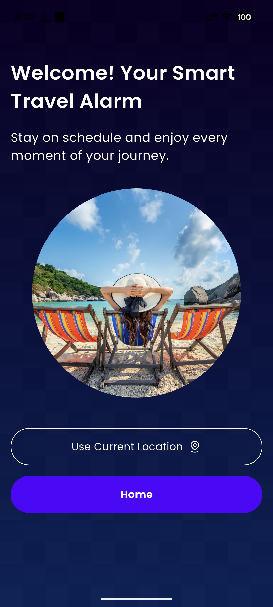
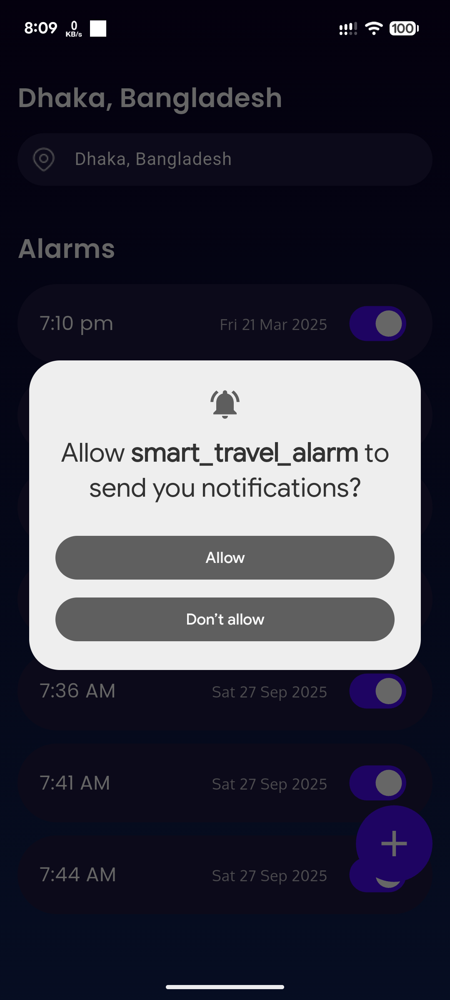
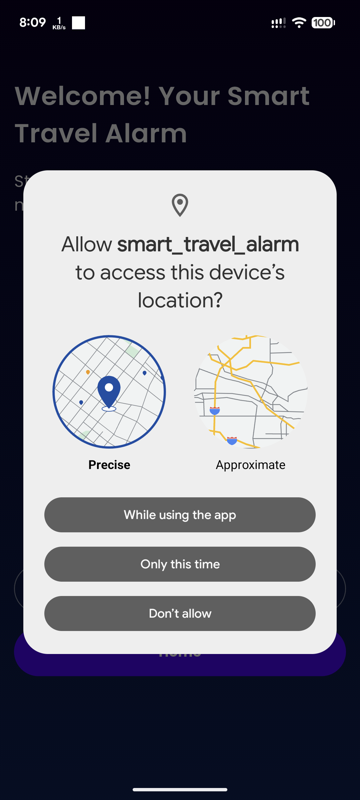
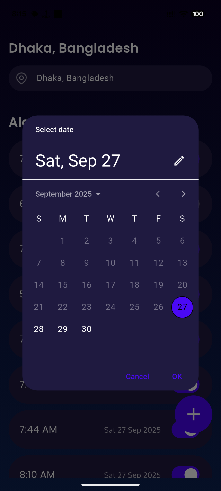
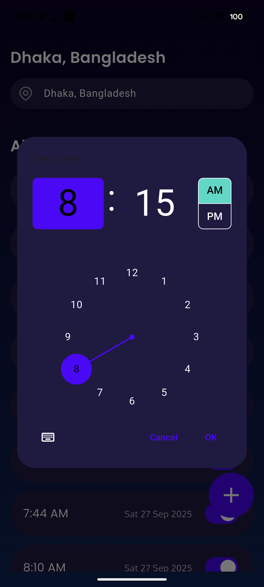
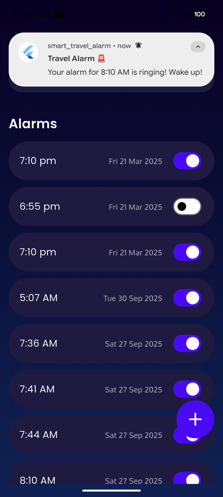

# 🚨 Smart Travel Alarm

Your journey-friendly alarm app built with Flutter. It combines elegant onboarding with video, location-awareness, and reliable local notifications so you never miss a moment. ✈️⏰

## ✨ What’s inside

-   Smart alarms with precise, exact scheduling (local notifications + timezone)
-   Location-aware experience using current city or manual input
-   Beautiful onboarding with inline looping videos
-   Persistent storage for alarms (survive restarts)
-   Clean, modular architecture with GetX for state and navigation
-   Modern UI with gradients, custom fonts (Poppins & Oxygen)

## 🧭 App flow (high level)

1. Onboarding (video + text, Skip/Next) → 2) Location picker (detect or type) → 3) Home (view, add, toggle alarms) → 4) Notification rings at scheduled time.

Key screens are included below in Screenshots.

## 🏗️ Architecture & structure

Feature-first organization with focused helpers and shared UI components.

```
lib/
├── common_widgets/        # Gradient background, common button, etc.
├── constants/             # Typography & styles (Google Fonts)
├── features/
│   ├── onboarding/        # Pages, controller, video widget, model
│   ├── location/          # Location screen, controller, button
│   └── home/              # Home screen, alarm list/card, model
├── helpers/               # Alarm, notification, storage, location services
└── main.dart              # App bootstrap (GetMaterialApp)
```

Core responsibilities:

-   helpers/notification_service.dart → wraps flutter_local_notifications + timezone
-   helpers/alarm_service.dart → schedules/cancels/toggles alarms
-   helpers/alarm_storage_service.dart → persists alarms via shared_preferences
-   helpers/location_service.dart → geolocator + geocoding for address
-   features/\* → UI + GetX controllers

## � Tools & packages used

-   get: lightweight state management and navigation
-   video_player: render onboarding videos from assets
-   google_fonts: Poppins & Oxygen
-   flutter_svg: vector assets (if needed by design)
-   intl: time/date formatting
-   flutter_local_notifications: local notifications for alarms
-   timezone: schedule at exact local times reliably
-   permission_handler: runtime permissions (notifications)
-   geolocator: device GPS
-   geocoding: reverse-geocode to human-readable address
-   connectivity_plus: network awareness (available for future use)
-   shared_preferences: persist alarms locally

All versions are pinned in `pubspec.yaml` (Dart SDK constraint: `^3.8.1`).

## 🚀 Setup & run

Prerequisites

-   Flutter 3.x with Dart ≥ 3.8 (per `pubspec.yaml`)
-   Xcode (iOS) and/or Android Studio + SDKs (Android)

Install & run

```bash
git clone https://github.com/shahriarnur03/smart-travel-alarm.git
cd smart-travel-alarm
flutter pub get
flutter run
```

Platform notes

-   Android
    -   Exact alarms: requests `SCHEDULE_EXACT_ALARM` on Android 12+ when needed.
    -   Post notifications: prompts on Android 13+ due to `POST_NOTIFICATIONS`.
    -   Boot persistence: receivers declared to handle reboots for scheduled alarms.
-   iOS
    -   Ensure Info.plist includes location & notification usage descriptions if you enable those flows in production:
        -   NSLocationWhenInUseUsageDescription, NSLocationAlwaysAndWhenInUseUsageDescription
        -   For notifications: user will be prompted at runtime.
    -   After `flutter pub get`, open `Runner.xcworkspace` if you build with Xcode.

## 📱 Screenshots

> All images live in `assets/screenshots/`.

| Onboarding 1                                                 | Onboarding 2                                                 | Onboarding 3                                                 |
| ------------------------------------------------------------ | ------------------------------------------------------------ | ------------------------------------------------------------ |
|  |  |  |

| Location                                                         | Allow notifications                                                 | Permission prompt                                                    |
| ---------------------------------------------------------------- | ------------------------------------------------------------------- | -------------------------------------------------------------------- |
|  |  |  |

| Set date                                                  | Set time                                                  | Alarm ringing                                                  |
| --------------------------------------------------------- | --------------------------------------------------------- | -------------------------------------------------------------- |
|  |  |  |

Additional captures:

-   `assets/screenshots/Screenshot_20250927-080920.png`
-   `assets/screenshots/Screenshot_20250927-081001.png`

## 🧪 How to verify features

1. Complete onboarding (Skip/Next) → arrive at Location screen.
2. Tap “Get Current Location” or type a location; proceed to Home.
3. On Home, tap + to pick a future date and time.
4. Confirm you see the new alarm in the list; toggle on/off to test scheduling.
5. Wait for the scheduled time; a local notification should fire. 🔔
6. Kill/restart the app → alarms list persists via shared_preferences.

## 🧹 Code quality highlights

-   Centralized NotificationService with timezone-aware scheduling
-   Clear separation of concerns (UI ↔ controllers ↔ services)
-   Defensive error handling with user feedback (snackbars/dialogs)
-   Reusable UI primitives (gradient background, button, text styles)
-   Lightweight, explicit state with GetX `obs` + controllers

## 📌 Future improvements (nice-to-have)

-   Repeat alarms, snooze, and custom sounds per alarm
-   Deep-link to “Exact alarm” settings page on Android 12+
-   iOS critical alerts (with entitlement) for alarm reliability
-   Background rescheduling and daily summaries

---

If you’re reviewing this for an interview: the code is structured to highlight clarity, separation of concerns, and practical use of Flutter ecosystems (GetX, local notifications, geolocation) while keeping the UI polished and responsive. 🙌
